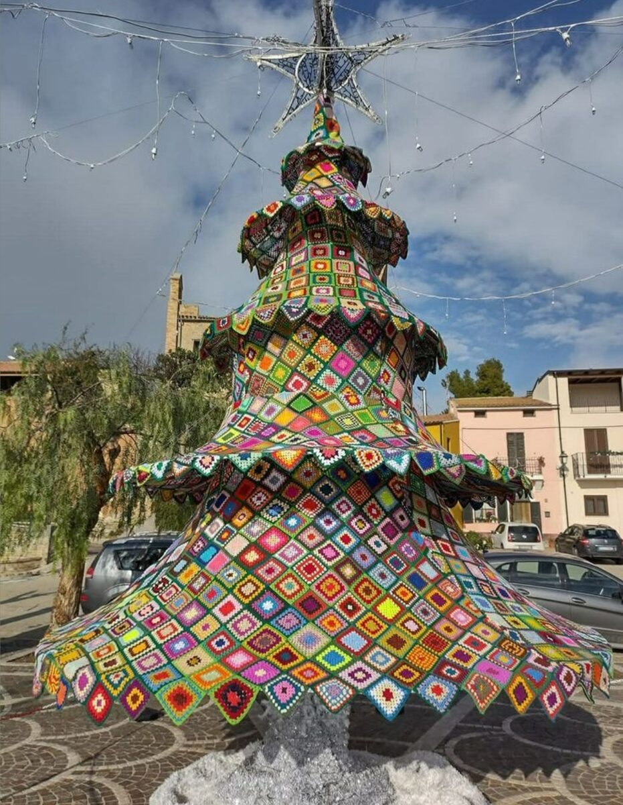
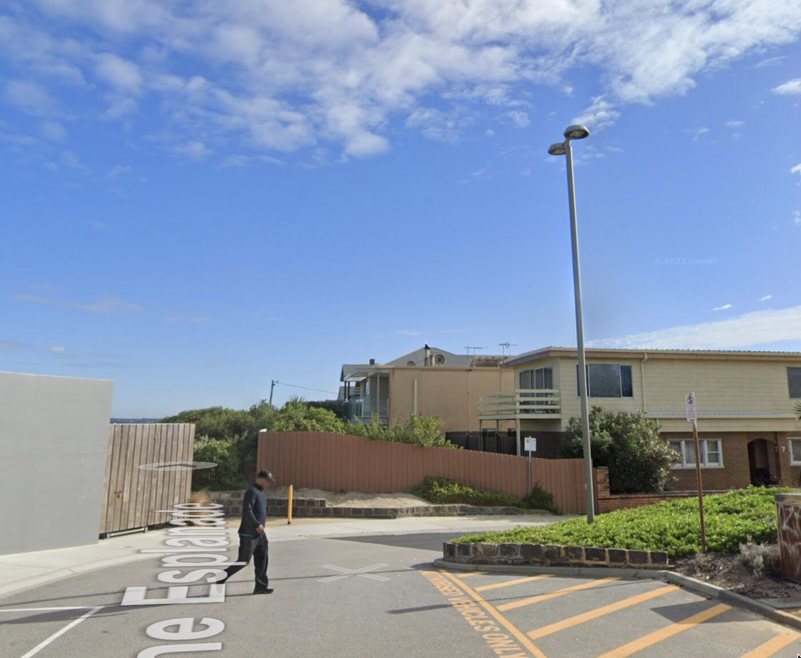
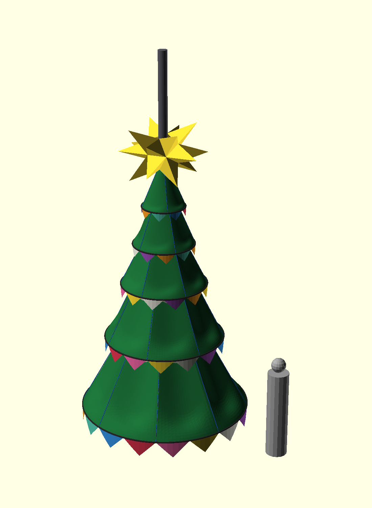
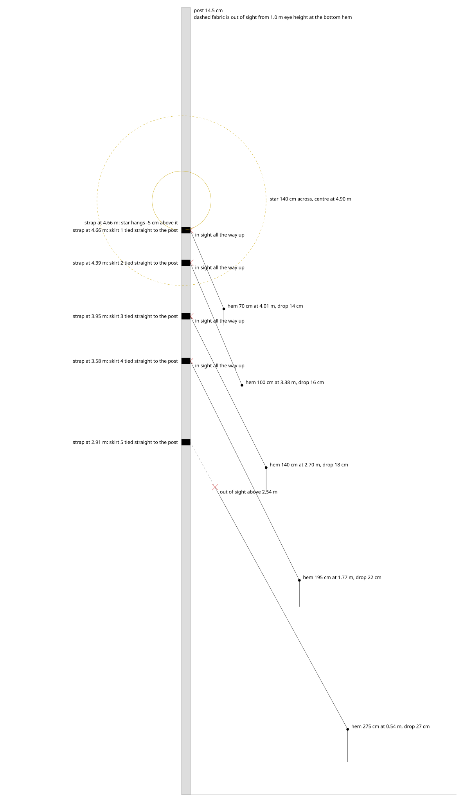
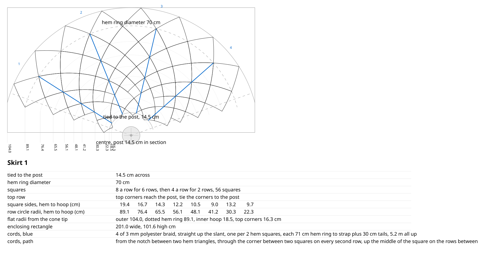
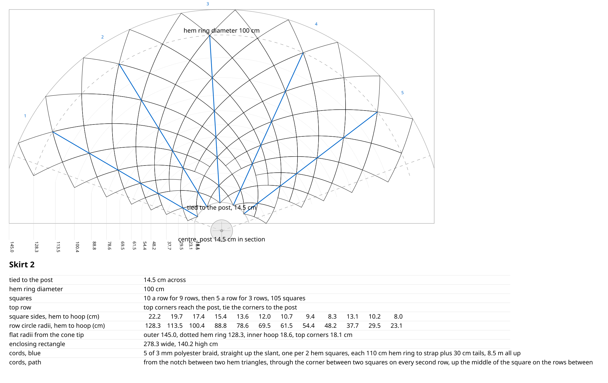
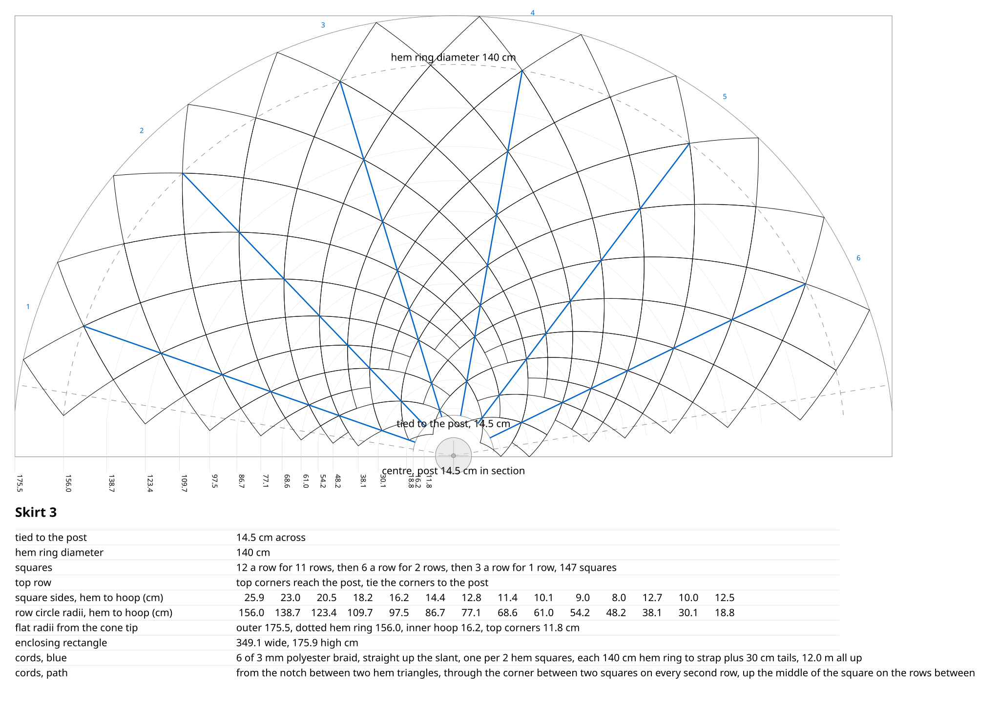
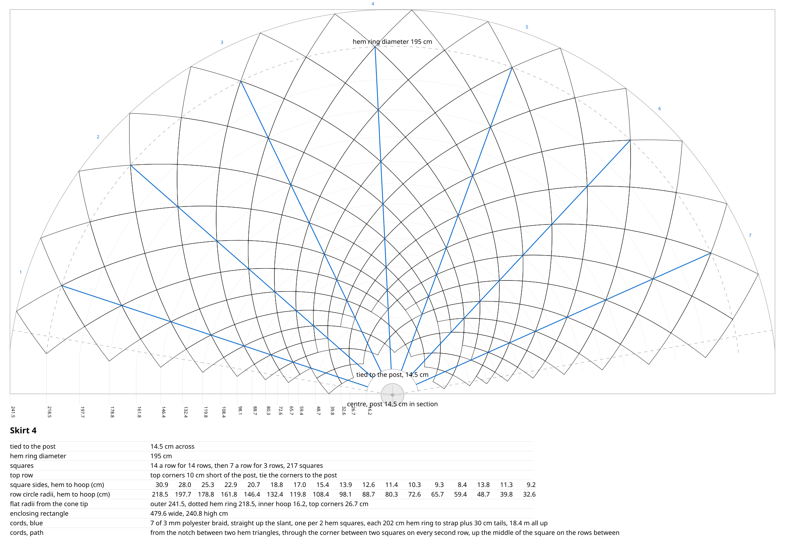
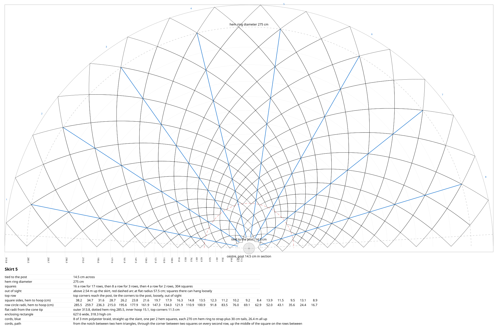
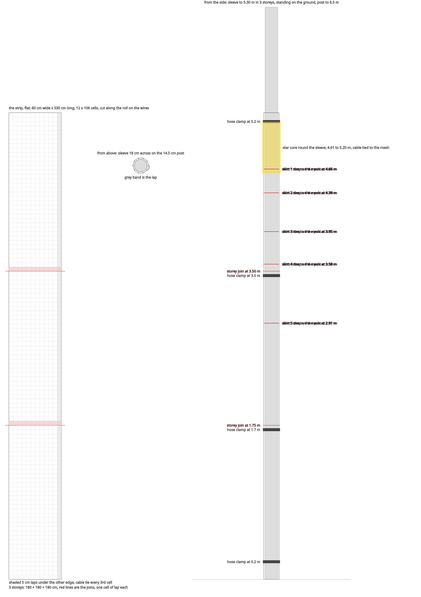

# Tree: the granny-square Christmas tree on the lamp post

A plan for yarn bombing the lamp post on the Edithvale foreshore as a
Christmas tree: five cone skirts of crocheted granny squares, and a
crocheted star on top. This file has the granny square sizes and how they
stitch together, the flat pattern for every skirt, and the plan for mounting
the whole thing on the post.

The inspiration photo, somewhere in Italy. Tiered skirts of granny squares
over a pole, with a zigzag hem on each tier.

The post it goes on: steel, 14.5 cm across, with shrubs around the base that
keep the bottom hem off the ground.

The model, with a 1.7 m person beside it for scale. Open
[platonic/tree.stl](../platonic/tree.stl) to turn it around in the browser;
GitHub renders it as an interactive 3D view.

## The design as it stands

Lamp post: steel, 14.5 cm across (45 cm circumference, from an old note and
the street view), at least 7 m tall. A 6.5 m post is drawn.

Five cone skirts of granny squares, every skirt's fabric running to the post,
no inner hoops. Hem rings of fibreglass rod and aluminium tube, see below.
Bottom hem 54 cm off the ground
because of the shrubs round the post.

| skirt | strap on post | hem ring | hem height | hem square | squares |
| ----- | ------------- | -------- | ---------- | ---------- | ------- |
| 1     | 4.66 m        | 70 cm    | 4.01 m     | 18 cm      | 56      |
| 2     | 4.39 m        | 100 cm   | 3.38 m     | 22 cm      | 105     |
| 3     | 3.95 m        | 140 cm   | 2.70 m     | 25 cm      | 147     |
| 4     | 3.58 m        | 195 cm   | 1.77 m     | 30 cm      | 217     |
| 5     | 2.91 m        | 275 cm   | 0.54 m     | 36 cm      | 304     |

Lowered on 2026-09-15 so the star's core sits fully on the mesh sleeve: skirt
5 down 6 cm, each skirt above 7 cm more than the one below, 34 cm at the top.
Every skirt kept its drop, so the patterns and cords did not change. On
2026-09-16 skirt 1's strap went up another 5 cm, to 4.66 m, so its peak
reaches the star. That one skirt is now 65 cm tall instead of 60 cm; its
pattern changed, the other four did not.

Total 829 squares. Every row of a skirt holds the same number of squares,
set on point, each row inward a little smaller (the grid is two families of
equiangular spirals, so the cells stay true squares). When a row's squares
would fall under 8 cm, four merge into one and the count halves. Hem counts
are even (8, 10, 12, 14, 16) so the merges work. The hem row is centred on
the hem ring and its lower halves hang below it as the zigzag.

Proportions: each skirt is 0.71 as wide as the one below. The heights ran
0.8 as well until skirt 1 was raised to meet the star, and now go 0.64,
0.81, 0.69, 0.76 from the top down.

### Cords

Low-stretch cords carry the hem ring's weight to the strap, so the hem hangs
at cord length and the fabric only hangs off the cords. Each cord runs
straight up the slant from the hem ring to the strap, one cord per two hem
squares. Hem counts are even, so the cords come out evenly spaced round the
ring. Each starts at a notch of the zigzag hem, the high point between two
hanging triangles, and on the way up passes through the corner between two
squares on every second row and up the middle of the square on the rows
between. The patterns draw them in blue, numbered at the hem. `CORD_EVERY` and `CORD_TAIL` in
`skirts.py` set the spacing and the knot allowance.

| skirt | cords | each, ring to strap | to buy |
| ----- | ----- | ------------------- | ------ |
| 1     | 4     | 71 cm               | 5.2 m  |
| 2     | 5     | 110 cm              | 8.5 m  |
| 3     | 6     | 140 cm              | 12.0 m |
| 4     | 7     | 202 cm              | 18.4 m |
| 5     | 8     | 270 cm              | 26.4 m |

About 70 m of 3 mm polyester braid with 30 cm tails at both ends. Nylon
stretches and wire kinks and chafes the yarn, so neither.

Between two cords the fabric hangs in a curve. The fabric is
sewn to the hem ring, to the strap and to every cord, so the droop is nothing
on all three. Between them each panel falls through its sag point: midway
between two cords, a quarter of the way up, having fallen 45 percent of the
way from the cone down to the hem ring's own plane. The fabric therefore
never hangs below its ring. Over a cord it folds rather than rounding off, so
each cord reads as a crease the full height of the skirt.

`SAG_T`, `SAG_DROP` and `FIN` in `skirts.py` are the three numbers: where the
sag point sits, how far it falls, and how sharply the fabric folds over a
cord. The patterns are cut for the plain cone.

### Hem rings

The rings hold the hem out to its circle. They carry little load, because the
flat pattern is cut so the fabric's hem already matches the ring and the cords
take the weight. What they have to do is stay round and go on around the post.

No ring can be lifted over the lamp post. There is a lamp arm at the top and
the mesh sleeve stands on the ground, so nothing threads on from either end.
Every ring has to be closed in place, around the post, by one person standing
on the ground.

That is easier than it sounds, because the ring is not a hoop you lift.
Crochet a channel into the hem, stand the skirt around the post, feed the rod
through the channel all the way round, and join the two ends where they meet.
The rod travels as a straight length or a loose coil and only becomes a ring
at the last step, so nothing is sprung open or forced shut.

#### Materials

Poly pipe was the first plan and it will not do. It rests as a coil about a
metre across and fights you at any other diameter, so it pulls the ring into a
lobed shape wherever the crochet lets it.

| skirt | hem ring | ring                 | length | weight |
| ----- | -------- | -------------------- | ------ | ------ |
| 1     | 70 cm    | 10 mm aluminium tube | 2.2 m  | 170 g  |
| 2     | 100 cm   | 10 mm aluminium tube | 3.1 m  | 240 g  |
| 3     | 140 cm   | 8.5 mm fibreglass    | 4.4 m  | 470 g  |
| 4     | 195 cm   | 9.5 mm fibreglass    | 6.1 m  | 830 g  |
| 5     | 275 cm   | 11 mm fibreglass     | 8.6 m  | 1560 g |

About 3.3 kg and roughly $180: $19 of aluminium and $160 of tent pole.

Rod thickness scales with ring size, because the bending stress in a rod bent
to a circle goes as rod diameter over ring radius. At the sizes above each
fibreglass rod runs at roughly a quarter of its bending strength.

**Fibreglass on the three big rings, because it springs back.** Skirt 5's hem
sits at 54 cm and skirt 4's at 1.77 m, both within reach on a public foreshore.
A child hanging on the bottom hem puts about six times the bending moment an
aluminium tube takes elastically, and aluminium keeps every dent. Fibreglass
returns to shape, and its fatigue life takes a season of coastal wind without
complaint. It has no coil memory either: bent into a closed loop it carries the
same curvature all the way round, and a true circle is the shape it settles
into.

**Aluminium on the two small rings, because they are a different problem.**
They sit at 4.01 m and 3.38 m where no hand reaches, and they are the least
flexed of the five: four cords on a 2.2 m ring gives 55 cm spans against skirt
5's 108 cm, and bending moment goes with span squared. Aluminium also takes a
screw, a rivet or a cable tie without splitting, which fibreglass does not, and
10 mm tube is on the shelf at Bunnings while nobody sells fibreglass thinner
than the 7.9 mm tent pole. Bending 10 mm tube to skirt 1's 35 cm radius is
thirty-five times the tube diameter, so there is no kink risk.

Ready-made craft and lampshade hoops look like a shortcut for the small rings.
They come welded shut, so each would have to be cut and sleeved anyway.

#### Bending the aluminium

By hand, no tools. Skirt 1 is the tightest at 35 cm radius and the outside of
the bend stretches about 1.4 percent, against the eight or more this alloy
takes before it cracks. No filler, no heat.

Chalk the circle on the driveway first, with a nail and a string. Bend to the
line and check as you go; without a line you will make an egg. Walk your hands
along the tube, putting a small bend in every few centimetres rather than a big
one in one place, because a kink comes from concentrating the bend. Over-bend
slightly and let it spring back onto the line. A bin or a pot gets you close
before the fine-tuning. Bend the ring before threading it: a pre-curved tube
follows the channel far more easily than a straight one.

If a tube feels brittle or fights you, stop. That means a harder temper than
assumed, and it is worth knowing before buying the lot.

#### Joining the ends

An internal sleeve, then two screws, at a cord point where the crochet is
anchored and the channel is supported.

- **Aluminium.** 10 mm tube has an 8 mm bore. An 8 mm hardwood dowel plugs it;
  Bunnings does not stock 8 mm aluminium.
- **Fibreglass.** A ferrule, a short alloy or vinyl sleeve over butted ends.
- **Make the sleeve long**, at least ten tube diameters, so 100 to 150 mm. A
  short sleeve lets the join hinge and the ring goes egg-shaped there.
- **Two stainless self-tappers**, one each side, drilled at home rather than up
  a ladder. Stainless so they do not seize in aluminium after a wet month. A
  pop rivet is stronger; screws come back out.

Tent pole push-button clips do the same job if you want it to part by hand.

### The flat patterns

One per skirt, cut as a ring sector. The dotted arc is the hem ring, the inner
arc is the post, the blue lines are the cords and the legend carries every
measurement.

Star: great stellated dodecahedron, span 140 cm, ridge struts 50 cm, core
edges 30.9 cm centre to centre, edge up with the post through it. The two
spikes straight up, the two straight down, and the two core struts that
would cross the post are left off. The core runs from 4.61 to 5.20 m, centred
at 4.90 m. It reaches 5 cm below the top strap, so skirt 1's peak stands
inside the star and no bare post shows between them. That is `STAR_LIFT` in
`skirts.py`, now minus 50 mm. `platonic/kepler.scad` says the core stakes cut to
306 mm for 500 mm ridges with the printed hubs and tips, which fit any
strut length.

Mesh sleeve: 50 x 50 mm galvanised welded mesh, 2.5 mm wire, a 60 cm wide
strip wrapped on the post, three storeys of 180 cm lapped a cell, to 5.30 m,
standing on the ground. The strip laps 5 cm at the seam, so the wrapped
circumference is 55 cm and the sleeve is 17.5 cm across on the 14.5 cm post.
That leaves 15 mm all round. Skirts and star cable-tie to the mesh.

Four hose clamps hold the sleeve to the post, at 0.2, 1.7, 3.45 and 5.2 m:
Kinetic 159-181 mm, 304 stainless, $6.75 each at Bunnings, so about $27. That
range takes the 17.5 cm sleeve with 16 mm of adjustment still in hand, which
is what pulls the sleeve tight as the noodle battens compress. The top clamp
goes on snug before the hoist so the sleeve can slide up.

Cushioning: pool noodles cut lengthwise into battens about 20 mm square, six
of them up the post, one every 7.6 cm round it. Slit a noodle once and unroll
it flat, then cut the battens off the slab; that yields far more length than
splitting it into halves. Each batten compresses from 20 mm into the 15 mm
gap, so the sleeve grips rather than rattles and the mesh never touches the
paint.

Cutting: three 60 cm strips come out of each 1.8 m length. Cut beside a wire,
not through one, snipping the crossing wires right next to the wire on the cut
line. That wire stays whole on one piece and the other piece gets a bare edge,
which is what a lap wants: bare edge under, wired edge over. The three pieces
end up with slightly different wire spans, and the difference is taken up at
the seam.

Tying: galvanised tie wire, 1.2 to 1.6 mm, twisted with pliers. The horizontal
joins between storeys carry the weight, about 35 kg wet at the lowest one, so
tie those at every cell across the lap; that is about 3 kg a tie. The vertical
seam only stops the sleeve springing open and the clamps already do most of
that, so every third cell is enough there. Cable ties would hold the load but
creep under steady tension and perish in UV.

The star's core, 4.61 to 5.20 m, sits fully on the sleeve with 10 cm to
spare, so its lower and upper hubs both cable-tie to the mesh. The top clamp
at 5.2 m is level with the core's top; the hubs tie above and below it.
Before the skirts were lowered the core ran to 5.59 m and a fourth mesh
storey would have been needed.

Install plan: rope over the lamp arm with a throw line, padded where it
crosses the arm; assemble sleeve, skirts and star on the ground; hoist; tighten clamps at 0.2 and 1.7 m from a step ladder or the
ground. The rope is a hoist and a backstop, never a personal anchor. Nothing
pegged within a metre of the post base (buried cable); the bottom ring is
tied down to stakes at the shrub line or to the shrubs.

Weight, at 18 g per 15 cm square: fabric about 20 kg dry, 42 kg soaked,
27 kg after draining; rings 3.3 kg; star, cords, straps 3 kg. Weigh one real
square and rerun; that one number drives it.

## To do

- **Cord count.** One per two hem squares, so 4 / 5 / 6 / 7 / 8. That keeps
  every square within one square of a cord. `CORD_EVERY` sets it; at 4 the
  counts halve again and a skirt 5 column between cords would carry about
  1 kg of wet fabric at the strap, the stretch test load.
- **Stretch test.** Run it, then set `STRETCH` or drop the idea.
- **Star span.** `skirts.py` draws a 140 cm span with 50 cm ridge struts, the
  ideal geometry. `kepler.scad` says 50 cm cut stakes plus the connectors give
  148 cm, because a stake stops short of a connector's centre. One of the two
  numbers should move.
- **Droop amount.** `SAG_DROP` is a guess at 0.45, so skirt 5's fabric falls
  27 cm below the cone at its lowest. The stretch test will say.

Done on 2026-09-15: straight cords on the patterns and in the model, the
fabric drooping between them in the model with the rings flat, skirts lowered
so the star sits on the mesh. Done on 2026-09-16: the curve the fabric hangs
in between the cords.

## Open questions

- **Fabric stretch.** The cords (see above) take the ring's weight, so
  what is left is the fabric stretching between lacing points under its own
  weight, wet. Untested. The test:
  1. Crochet a strip of three hem squares of skirt 5 (36 cm) joined on
     point, the way they hang.
  2. Measure it relaxed, dry: tip to tip along the strip, and the width of
     the middle square across its side corners.
  3. Hang it by the top tip, soak it, hang 1 kg from the bottom tip. 1 kg
     is about what one column of skirt 5 carries at the strap with no
     cords, so it is the worst case, not the cord case.
  4. Measure again after a night, still wet and loaded. Then unload, let it
     dry and measure once more for what stays.
     Squares on point do not stretch like a sheet, they shear: the edges keep
     their length and each square becomes a rhombus, taller and narrower.
     Five percent taller is about five percent narrower.
- **`STRETCH` factor, if the test says more than a few percent.** One number
  in `skirts.py`, hung length over relaxed length, 1.0 for none. In the
  log-polar grid the cell would become a rhombus, taller by `STRETCH` along
  the slant and narrower across by `sqrt(2 - STRETCH^2)`, so the hem count
  goes up a little and the row count down. Squares are still crocheted
  square. Not implemented until the test gives the number.
- **Sight line.** With the hem at 54 cm and the viewer's eye at 1.0 m,
  skirt 5 is out of sight above 2.54 m (red dashed arc on its pattern); the
  other four are in sight all the way up. The merge there did not change
  skirt 5's count. Julia may want a merge height set by hand for skirt 5
  instead. `EYE_R` and `EYE_Z` at the top of `skirts.py` are the viewer.
- **Skirt 4 stops 10 cm short of the post** because 14 a row merges to 7,
  which cannot halve. Tie the corners across the gap, or accept.
- **Scad preview** draws graded squares without the merges. Counts are
  right (they come from the script); the picture of the top rows is not.
- **Commit.** None of the tree work is committed yet: `Makefile`,
  `design/skirts.py`, `design/mesh.py`, `design/gsd.py`, `design/tree/`,
  `platonic/tree.scad`, `platonic/tree_params.scad`, `platonic/gsd.scad`,
  `platonic/tree.stl`, plus older untracked files in `platonic/` and
  `design/photos/`. `design/__pycache__/` should be ignored, not committed.

## Sources

- Hose clamp, Kinetic 159-181 mm:
  https://www.bunnings.com.au/kinetic-159-181mm-304-stainless-steel-hose-clamp_p0110748
- OZtrail fibreglass tent pole kits, 7.9 to 12.5 mm, at BCF:
  https://www.bcf.com.au/p/oztrail-fibreglass-tent-pole-kit-9.5mm/311328.html
- OZtrail direct, with click and collect:
  https://www.oztrail.com.au/products/fibreglass-tent-pole-kit-9-5-mm
- Metal Mate 10 x 1 mm aluminium round tube, $3.55 a metre, and 12 x 1 mm in
  3 m at $14.84, both at Bunnings:
  https://www.bunnings.com.au/products/building-hardware/steel-aluminium-sections/aluminium-extrusions-mouldings/aluminium-tubes

## Working notes

Written on 2026-09-15 and 2026-09-16. `platonic.md` has the piece as a whole;
this file is only the tree.

### One source of numbers

Every number lives in `design/skirts.py`. Running it writes
`platonic/tree_params.scad`, which the OpenSCAD model includes, and
`design/mesh.py` imports from it. Never edit the scad's numbers by hand.

    make tree                        # patterns, section, params, STL, mesh sketch
    python3 design/skirts.py all     # skirt-1..5.svg + section.svg + params
    python3 design/skirts.py 5       # one skirt
    python3 design/skirts.py 5 300   # one skirt with a 30 cm hem square, separate file
    python3 design/mesh.py           # mesh.svg

Outputs, all in `design/tree/`: `skirt-1.svg` to `skirt-5.svg`,
`section.svg`, `mesh.svg`. Earlier variants are in `design/tree/archive/`.

The model of the whole tree is
[platonic/tree.stl](../platonic/tree.stl), which GitHub renders in the
browser.
